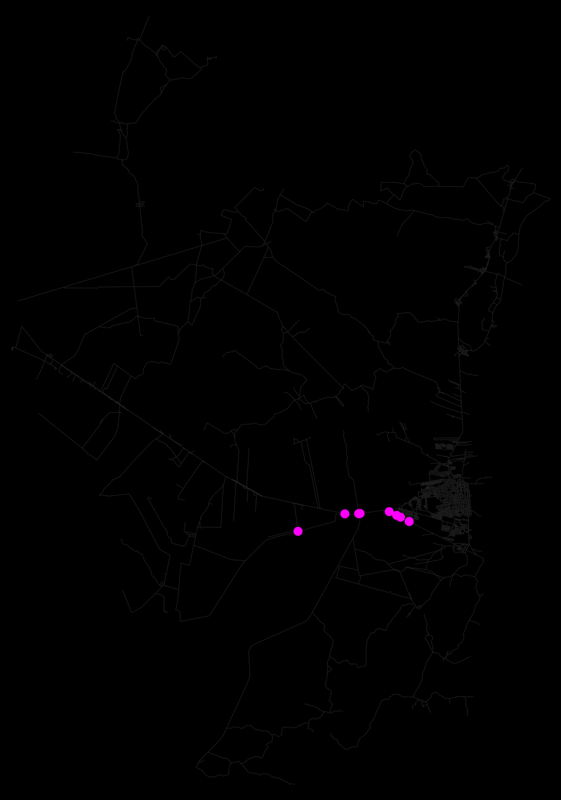
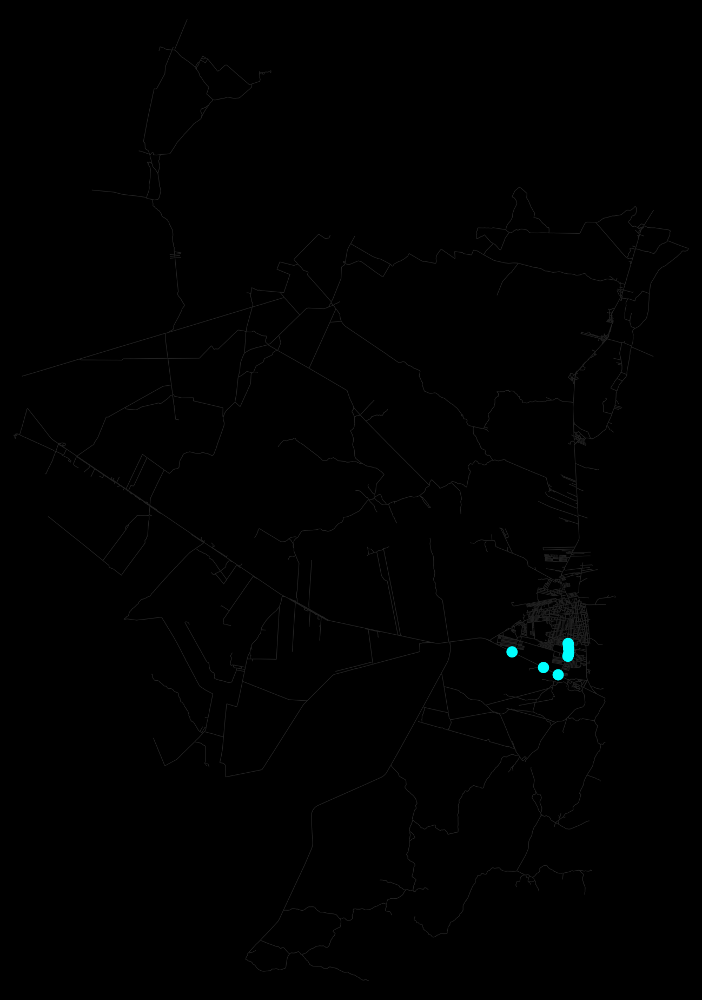
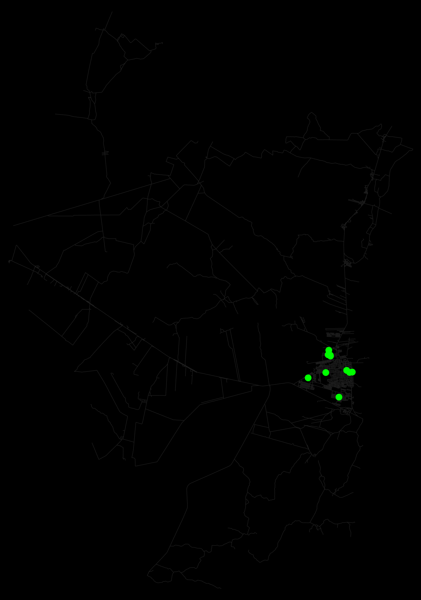
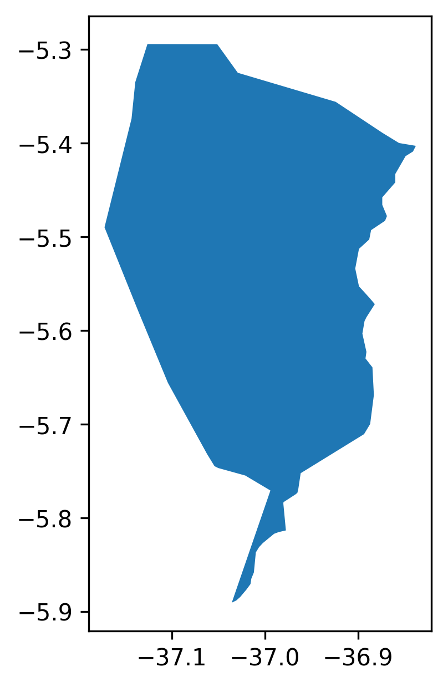
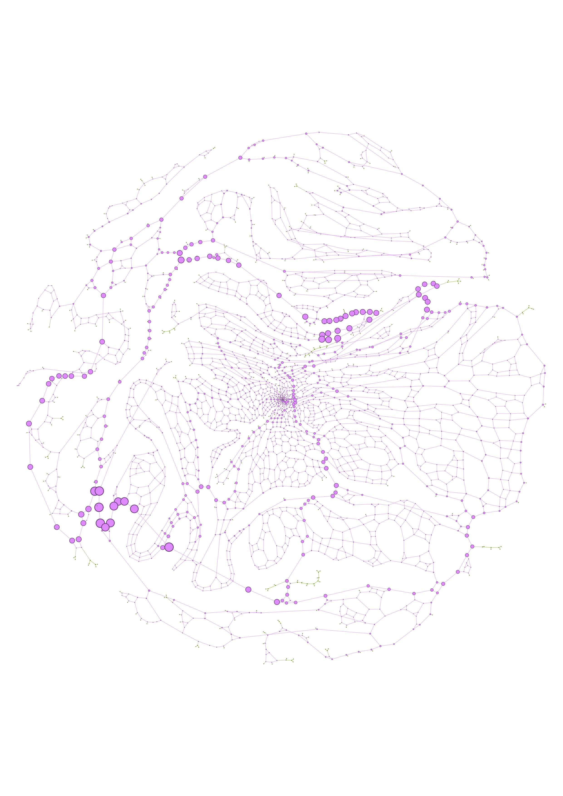
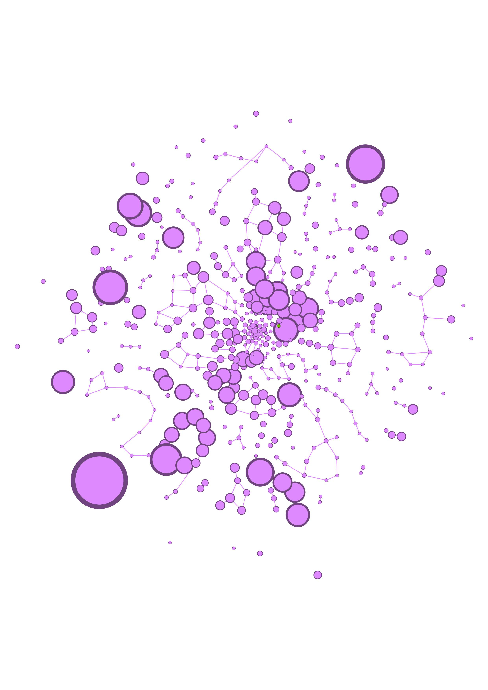
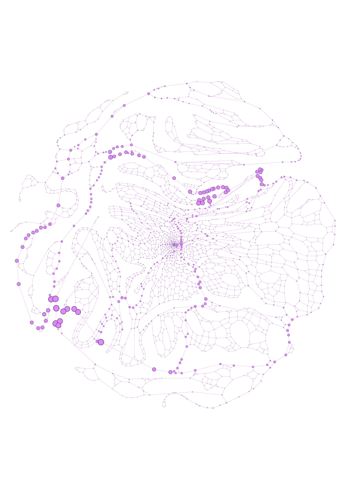
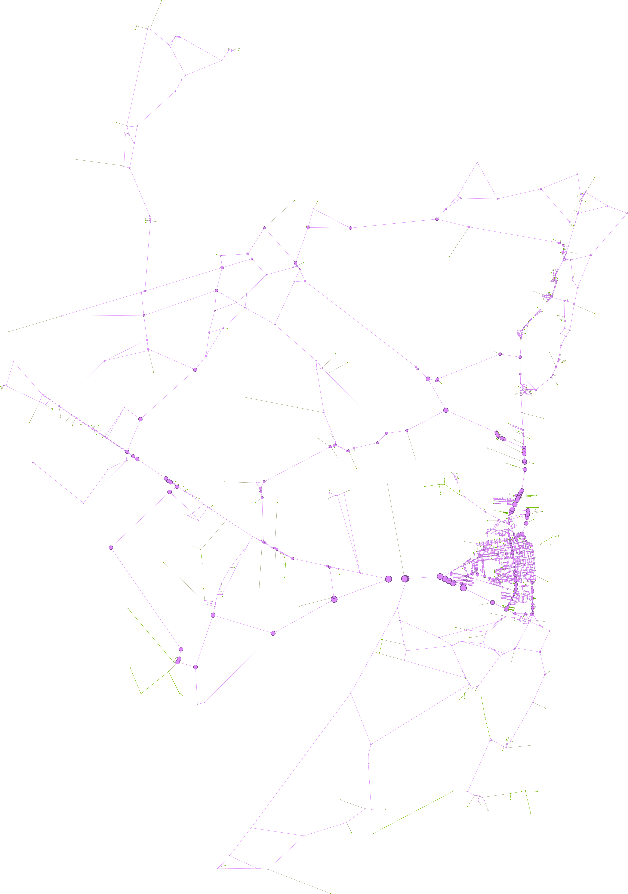

# Structural_Analysis_Urban-Networks_OSMnx_NetworkX_Gephi

#membros do grupo:

João Paulo Oliveira Cabral;
Gustavo Quezado Gurgel Magalhães.

---

## Sobre o Projeto

Este projeto realiza uma análise estrutural de redes urbanas utilizando dados reais do OpenStreetMap. A malha viária da cidade é transformada em um grafo matemático para permitir estudos de conectividade, mobilidade e estrutura urbana.

Foram utilizadas as seguintes ferramentas:

* Python
* OSMnx
* NetworkX
* Gephi

---

# Objetivos

* Extrair redes viárias urbanas
* Modelar ruas e interseções como grafos
* Calcular métricas estruturais
* Identificar vias importantes e gargalos urbanos
* Exportar os dados para visualização no Gephi

---

# Modelagem da Rede

A metodologia do projeto foi dividida em etapas de coleta, modelagem, análise e visualização dos dados.

Inicialmente, a biblioteca OSMnx foi utilizada para obter automaticamente os dados da malha viária diretamente do OpenStreetMap. Em seguida, a rede urbana foi transformada em um grafo utilizando o NetworkX.
A cidade é representada como um grafo onde:

* Nós → interseções
* Arestas → ruas

A rede preserva características reais como:

* sentido das vias (que não utilizamos por opção);
* conectividade;
* distâncias;
* hierarquia urbana.

---

# Métricas Analisadas

As métricas analisadas no projeto permitem compreender diferentes características estruturais da rede urbana. A Degree Centrality foi utilizada para identificar os nós mais conectados da cidade, destacando interseções com maior quantidade de conexões. A Betweenness Centrality permitiu detectar ruas e cruzamentos críticos para o fluxo urbano, evidenciando pontos que concentram muitos caminhos mínimos da rede e que podem atuar como gargalos de mobilidade. Já a Closeness Centrality foi aplicada para avaliar a acessibilidade dos nós, indicando quais regiões possuem maior facilidade de alcançar os demais pontos da cidade. Além disso, a análise de componentes conectados possibilitou estudar o nível de fragmentação e robustez da rede urbana, verificando como a estrutura viária se mantém conectada.

---

# Visualização

Os grafos podem ser exportados para o Gephi e no nosso caso objetivamos permitir a visualização avançada da regiao assim como analise espacial e a capacidade de detecção de comunidades.

---

# Espaço para Gráficos e Resultados

## grafo top betwewnness

---

## grafo top closeness

---

## grafo top degree

---

## grafo municipio de borda

---

## grafico force atlas 2

---

## grafico force atlas 2 15%

---

## grafico k-core=2 force atlas 2

---

## grafo graph_GeoLayout

---

## grafo graph_GeoLayout 15%

.

---

## grafo graph_GeoLayout k-core=2

---

# Resultados Principais:

Os principais resultados do projeto foram a modelagem da malha viária urbana como uma rede matemática e a análise de sua estrutura através de métricas de grafos. A partir dos dados do OpenStreetMap, foi possível identificar vias e interseções mais relevantes da cidade utilizando métricas de centralidade, especialmente a Betweenness Centrality, que destacou ruas críticas para o fluxo urbano e possíveis gargalos de mobilidade. O projeto também permitiu analisar a conectividade e a robustez da rede urbana, observando como diferentes áreas da cidade se relacionam estruturalmente.

---

# Contexto Acadêmico

O projeto envolve conceitos de Teoria dos Grafos e Redes Complexas aplicados ao contexto da mobilidade urbana e dos sistemas urbanos. Através da modelagem computacional da malha viária, são utilizadas técnicas de Ciência de Dados Espaciais para representar e analisar a estrutura da cidade, permitindo estudar conectividade, acessibilidade e comportamento da rede urbana de forma matemática e visual.
Nesse formato foi possível a identificação de vias e interseções estratégicas usando métricas de centralidade, principalmente a Betweenness Centrality, mostrando quais regiões concentram maior fluxo potencial e podem atuar como gargalos urbanos. No nosso caso especificamente modelamos uma região urbana extensa que possui muitos intervalos sem um emaranhado de ruas por se tratar de uma cidade certamente mais tranquila, então em sua modelagem as ruas de maior foco e interesse apresentadas foram na br principal

# Referências

* OSMnx Documentation
* NetworkX Documentation
* Gephi
* OpenStreetMap
